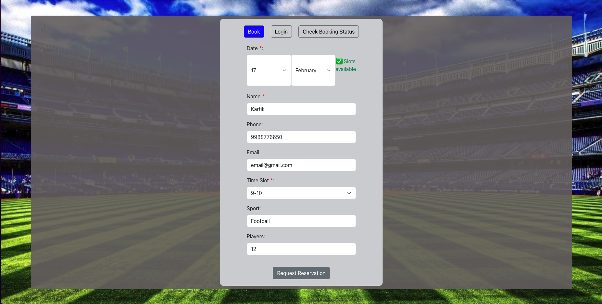
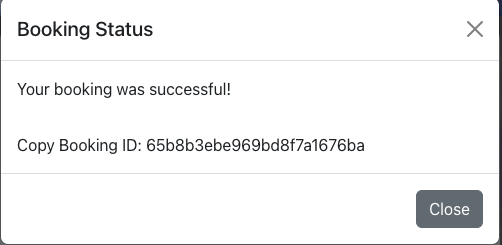
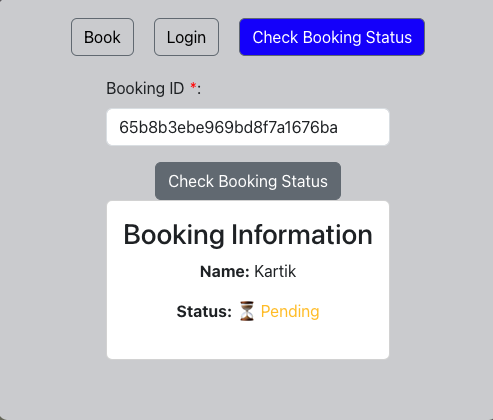
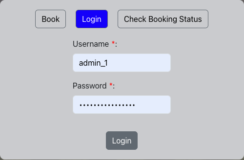
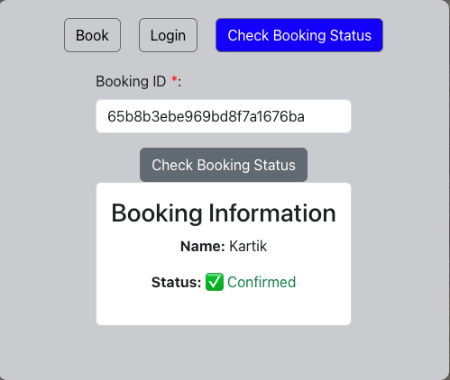

# Turf Reservation System

This project is a turf reservation system. The web frontend uses tech tools like React, CSS, Bootstrap, and Axios.

## User Stories

### As a Guest User

#### View Available Slots
Visitors can access the website to view the available time slots for booking. The system displays a list of available slots.

#### Book a Slot
Users can select their desired time slot for booking and proceed to the booking form.

#### Provide Booking Information
Guests need to enter basic information (name, phone, email) to confirm the booking.

#### Confirm Booking
Users have the ability to review the booking details and confirm the booking.

### As an Admin User

#### View Bookings
Admins can log in to the admin panel and view the list of pending bookings.

#### Confirm Reservation as Booked
After confirming payment, admins can mark the booking as booked.

#### Check booking status
Guest or Admin can check and verify booking status.

## Getting Started

Before you begin, ensure that you have forked and set up the backend repository, which is running successfully. You can find the backend repository at the following link: [Turf Reservation API](https://github.com/10kartik/turf-reservation-api).

Follow these steps to set up this repository:

1. **Fork the Repository:** Start by forking this repository to your own GitHub account.

2. **Clone the Repository:** After forking, clone the repository to your local machine by using the `git clone` command.

3. **Install Dependencies:** Navigate to the cloned repository's directory and run `npm install` to install all the necessary dependencies.

4. **Set Environment Variables:** Create a `.env` file in the root directory of the project and set all the required environment variables.

5. **Start the Server:** Run `npm start` to start the server. The application should now be running at `localhost:3000`.

6. **Make Changes:** After you've made your changes, commit and push them to your forked repository.

7. **Deploy the Application:** To deploy the application, type `vercel` in your terminal to create a preview deployment. Once you're ready to push your changes live, use `vercel --prod` to create a production deployment.

That's it! You've now successfully set up and deployed the application.
